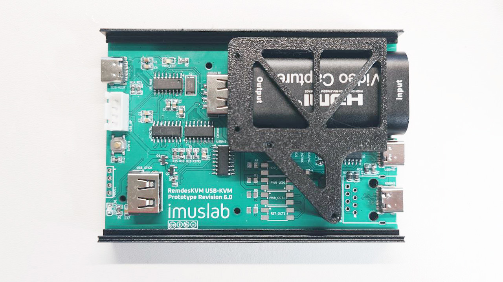

# RemdesKVM

Budget IP-KVM designed for my SFF homelab / minilab setup.  I build this just because I don't really trust those off-the-shelf KVMs and Pi-KVM is a bit too expensive if I want to have one KVM device per computer in my homelab cluster. 

> [!WARNING]
> This project is in its very early stage and not production ready. Use with your own risk. 


## Build

### Remdeskd (RemdesKVM daemon)

The Remdeskd is a golang written piece of code that runs on a x86 or ARM computer with Debian based Linux installed. Require v4l2 and alsa with kernel 6.1 or above.  

To build the Remdeskd, you will need go compiler. The go package manager will take care of the dependencies during your first build. 

```bash
cd remdeskd/
go mod tidy
go build

sudo ./remdeskd
# or use ./remdeskd -h to show all start options
```

(Setup the remdeskd as systemd service instruction will be added later)

#### Uskvm (IP-KVM firmware)

The usbkvm is developed with Arduino IDE. You will need the [ch55xduino broad API](https://github.com/DeqingSun/ch55xduino) installed in order to compile and flash the firmware to the USB-KVM hardware.

For first time flashing the firmware, **follow the steps below carefully**.

1. Prepare the firmware code in your Arduino
2. Press compile button and wait for the compiled binary get cached (to speed up the flash process)
3. Hold down the FLASH button on the USB-KVM PCB. **Do not release it until you are told to do so.**
4. Insert the USB cable into the USB-KVM host side port and connect it to your computer. You should see multiple device pops up in your device manager. If all parts are soldered correctly, you will see a USB hub with 3 devices under it, the USB capture card (which provide a video and audio device file), a USB to UART adapter and an unknown device. That Unknown device is our CH552g (without firmware)
5. Press the upload button in your Arduino IDE with no serial port selected
6. **Just after the code compiled, immediately release the FLASH button** (Notes: if you do this too slow, you will get a timeout in your Arduino IDE console. If you release too early, the MCU will reset itself and back to runtime mode. Try a few time if you keep having issues with this step)
7.  After the firmware upload, you should see a Serial device pop up in your device manager and the unknown device is gone. 


For future firmware re-flash or update, simply upload using the serial port like an ordinary Arduino dev board. 

## Architecture

The RemdesKVM project divides into two subsystems

1. IP-KVM Host software (running on x86 / ARM computer with USB host port)
2. USB-KVM Hardware and firmware (connect to KVM-host using USB)

Each of the parts can be used independently with or without the other part of the system.  For example, you can use the IP-KVM Host software with off-the-shelf USB-KVM that uses the same chipset used in the RemdesKVM USB-KVM device, or you can use the USB-KVM hardware and firmware on a Raspberry Pi with other KVM host software (with limited functionality). 

### Project Structure

- models -- 3D models files for 3D printing
- pcbs -- PCB gerber and schematics 
- remdeskd -- RemdesKVM Daemon, running on the IP-KVM host ARM SBC
- usbkvm -- Firmware for RemdesKVM USB-KVM on board MCU (Ch552g)

**Note: There will be no support if you are using 3rd party parts or systems. If you are creating a new issue, make sure you are using the official implementation here with the recommended hardware and software setups**


### Part List


## Change Log

Change log for USB-KVM hardware design

| Version     | Changes                                                      | Issues                                                       |
| ----------- | ------------------------------------------------------------ | ------------------------------------------------------------ |
| v1.0 - v2.0 | Concept prototypes                                           | -                                                            |
| v3.0        | Reduce complexity                                            | HDMI child board not working                                 |
| v4.0        | Restructure board form factor                                | CH552G do not handle UART signal fast enough for cursor movements |
| v5.0        | Added USB mass storage port and dedicated USB UART chip for UART to HID chip communication | USB mass storage power switch causes overcurrent on USB VBUS line and resets the whole bus |


